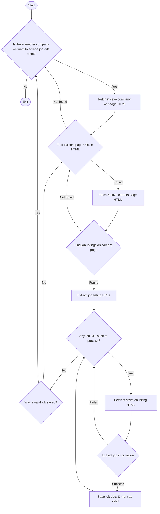

# Scrounger

This project extracts job listings from company websites using AI-powered analysis.


## Setup

1. Clone the repository
2. Install dependencies:

```sh
pip install requests beautifulsoup4 python-dotenv openai
```

3. Create a `.env` file in the project root and add your API keys:

```sh
OPENAI_API_KEY=your_openai_api_key_here
JINAAI_API_KEY=your_jina_api_key_here
```

4. Run the script:

```sh
python main.py https://example.com --output job_listings.csv
```

Replace `https://example.com` with the company's homepage URL you want to analyze.

## Features

- Automatically finds job listing pages
- Extracts job details using AI
- Saves results to a CSV file
- Caches HTML content to reduce API calls

## Requirements

- Python 3.7+
- OpenAI API key
- Jina AI API key

For more detailed usage and configuration options, please refer to the script's help:

```sh
python main.py --help
```

## Workflow

